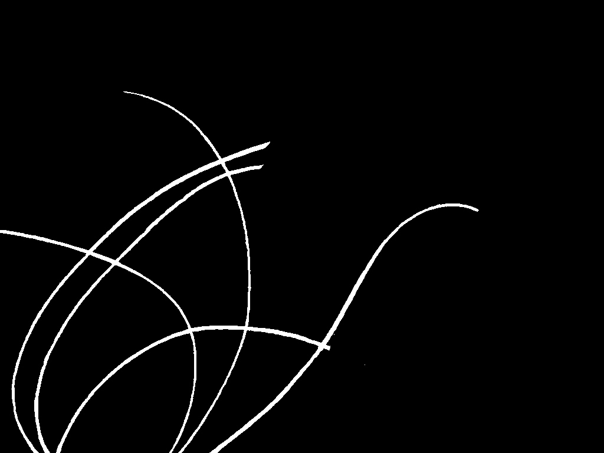

## Skin Hair Dataset: 
Setting the benchmark for effective hair inpainting methods for improving the image quality of dermoscopic images

# Introduction
Dermoscopic images are often contaminated by artifacts including clinical pen markings, immersion fluid air bubbles, dark corners, and most importantly hair, which makes interpreting them more challenging for clinicians and computer-aided diagnostic algorithms. Hence, automated artifact recognition and inpainting systems have the potential to aid the clinical workflow as well as serve as an preprocessing step in the automated classification of dermoscopic images. In this project, we
share the first release of a public dermoscopic image dataset with hair artifacts. The Skin Hair dataset contains over 252 dermoscopic images including artificial hair and will be expanded over time. Furthermore, we present the primary results of applying machine learning algorithms and GAN based architectures to the hair inpainting problem in dermoscopic images. We envision that these results will serve as a benchmark for researchers who might work on the hair detection and reconstruction tasks with this dataset in the future. In this work, we present a skin lesion image dataset based on the ISIC dataset containing dermoscopic images, images containing artificial hairs and the corresponding ground-truth masks. Furthermore, we use four hair inpainting methods including Navier-Stokes, Telea, Hair SinGAN and R-MNet architectures which we evaluate using image quality assessment metrics MSE, PSNR, UQI and SSIM. The R-MNet architecture achieved the highest SSIM score of 0.960.

# Motivation 
One of the advantages of deep learning methods is the relative lack of preprocessing needed. In most computer vision tasks, including segmentation and classification which are mostly based on CNNs, datasets without any preparation or preprocessing are directly passed to the backbone of the CNN network in order to learn thefeatures. However, prior research indicates that, in the case of dermoscopic image analysis, most of the algorithms perform better when the artifacts are removed or inpainted.
The presence of hair in dermoscopic images poses a significant challenge as they may occlude some of the information of the lesion such as its boundary and texture.  Hence, the removal of hair is an important preprocessing step which, due to its diverse appearances, causes significant problems. We propose a dermoscopic image dataset which gives the possibility to work in the area of removing artifacts and can be used as a benchmark for researchers working on hair detection and inpainting. 

# Dataset Description
The dataset has been designed based on the ISIC dataset and consists of dermoscopic images with artificially added hairs as well as corresponding binary masks. We divide the dataset into two separate parts containing hair and without hair, respectively. Due to the very large variety and complexity of the hair patterns, we decided to transfer the hair from other dermoscopic images, which allowed us to maintain their natural appearance (Fig. 1).

The process of creating a dermoscopic image with hairs consists of the following steps: 1) Choosing a raw image without artifacts from the ISIC dataset, 2) Choosing an image including hairs from the ISIC dataset, 3) Manually marking the hair areas using Photoshop quick mask with alpha channel, soft, round brush with full opacity and size adapted to the size of the marked hair, 4) Cutting out the hair to a new transparent layer and clearing any additional areas of skin visible on this layer, 5) Applying the hair mask to the dermatoscopic image.

The extracted hair patterns have been augmented using the following methods: 1) randomly moving and rotating the mask, 2) modification of the selection with small, medium and large number of hairs; 3) changing the color of the hair into three main categories (light, brown, and dark) using brightness, contrast tool and color blending mode; 4) randomly applying different masks onto different clean images, without hair; and 5) for each modified pattern, a reference mask was created using a threshold tool.
In total, we used 77 non-hair images as the basis for applying different hair configurations. We augmented the extracted hair by changing the size, amount and colour. In total 252 images were generated with 84 unique masks to cover the different hair types. The Skin Hair dataset contains:
35 images with small density (each in three colours - light, brown and dark), 27 images with medium density (each in three colours - light, brown and dark) and 22 images with high density (each in three colours - light, brown and dark).

# Result analysis
Fig. Summary of the IQA metrics including MSE, PSNR, SSIM and UQI for hair inpaining methods including Navier-Stokes, Telea, Hair SinGAN and R-MNet. † = higher value is better; ⊎ = lower value is better.

Fig. Visual comparison of the results of different methods: a) original dermoscopic image, b) dermoscopic image containing artificial hair, c) Navier-Stokes inpainted image, d) Telea inpainted image, e) Hair SinGAN inpainted image, and f) R-MNet inpainted image.

Fig. Illustrations of the SSIM algorithm for three hair inpainting methods: x) Telea, y) R-MNet and z) Hair SinGAN: a) image differences with darker regions show more
disparity. Larger areas of disparity are highlighted in black while smaller differences are in gray, b-c) filter using a minimum threshold area to remove the gray noise, and highlight the differences with a bounding box, d) visualisation of the exact differences with a mask on the original image.

# Accessing Dataset
1. Permission is granted to view and use the Skin Hair Dataset without charge for personal, non-commercial research purposes only. Any commercial use, sale, or other monetization is prohibited.

2. Other than the rights granted herein, the AGH University of Science and Technology retains all rights, title, and interest in the DSkin hair dataset

3. You may make a verbatim copy of the Skin Hair Images Dataset for personal, non-commercial research use as permitted in this Research Use Agreement. 

4. YOU MAY NOT DISTRIBUTE, PUBLISH, OR REPRODUCE A COPY of any portion or all of the Skin Hair Images Dataset to others without specific prior written permission from the AGH University of Science and Technology.

5. YOU MAY NOT SHARE THE DOWNLOAD LINK to the Skin Hair dataset to others. If another user within your organization wishes to use the dataset, they must register as an individual user and comply with all the terms of this Research Use Agreement.

6. You must not modify, reverse engineer, decompile, or create derivative works from the Skin Hair Dataset. You must not remove or alter any copyright or other proprietary notices in the Skin Hair Dataset.

In consideration for your agreement to the terms and conditions contained here, AGH grants you permission to view and use the Skin Hair Dataset for personal, non-commercial research. You may not otherwise copy, reproduce, retransmit, distribute, publish, commercially exploit or otherwise transfer any material.

Limitation of Use
You may use Skin Hair Dataset for legal purposes only.

